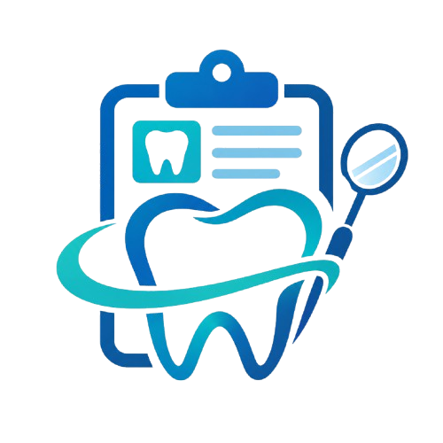
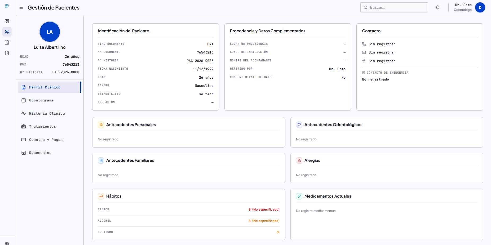
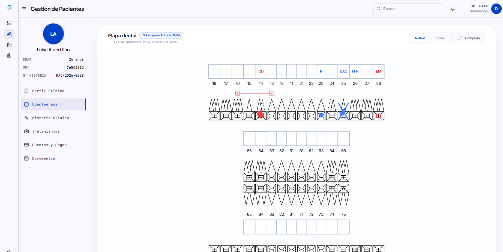
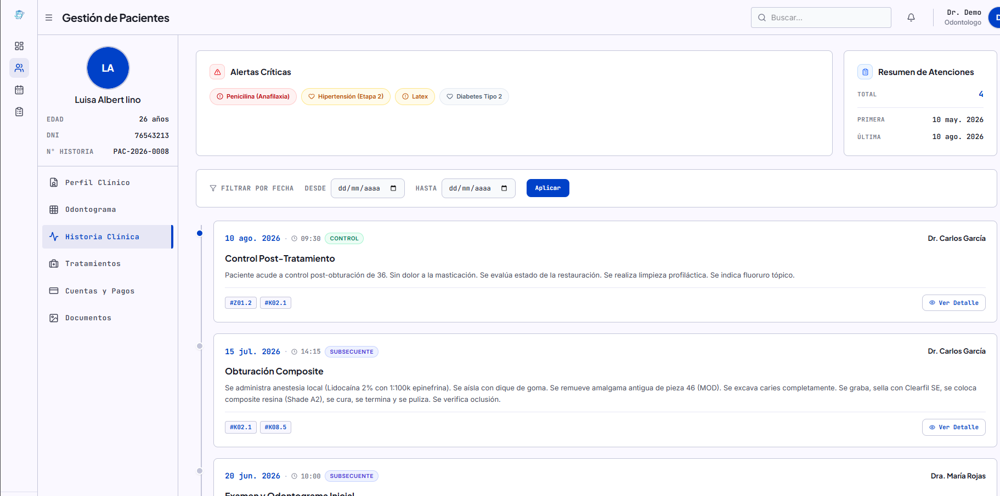

  

<h1 align="center">DentaRecords</h1>

  <strong>Sistema de Gestión Integral para Clínicas Dentales</strong> 
  <em>Historia clínica electrónica · Agenda de citas · Odontograma digital · Inventario · Facturación</em>

  <a href="#módulos">Módulos</a> ·
  <a href="#capturas">Capturas</a> ·
  <a href="#stack-tecnológico">Stack</a> ·
  <a href="#funcionalidades-por-rol">Roles</a>

---

## Sobre el proyecto

**DentaRecords** es una plataforma web desarrollada para digitalizar la gestión clínica y administrativa de clínicas dentales. Reemplaza procesos manuales (libretas, formatos en papel, agendas físicas) por un sistema centralizado que cumple con la normativa del **Ministerio de Salud del Perú (MINSA)** y el **Colegio Odontológico del Perú (COP)**.

El sistema está diseñado para ser utilizado por **odontólogos, asistentes y administradores** de la clínica, permitiendo:

- Registrar y consultar historias clínicas electrónicas completas
- Gestionar citas y la sala de espera en tiempo real
- Visualizar y registrar hallazgos en un odontograma interactivo
- Controlar el inventario de insumos y materiales
- Generar reportes financieros y estadísticos
- Exportar la historia clínica en formato PDF

---

## Módulos

### Historia Clínica Electrónica (HCE)
Registro completo y normativo del historial del paciente, incluyendo:
- **Anamnesis**: motivo de consulta, enfermedad actual, antecedentes personales/familiares, alergias, hábitos, medicamentos
- **Examen clínico**: signos vitales (PA, pulso, FC, FR, temperatura), examen general, extraoral e intraoral
- **Diagnóstico CIE-10** con búsqueda inteligente (Algolia)
- **Plan de trabajo**: tratamientos ejecutados y planificados, con costo
- **Control y evolución**: notas de evolución, recomendaciones, receta
- **Alertas críticas**: alergias, condiciones médicas y medicamentos destacados visualmente
- **Exportación PDF**: historia clínica completa lista para imprimir

### Odontograma Digital
Mapa dental interactivo con:
- Representación gráfica de los 32 dientes (permanentes y temporales)
- Registro de hallazgos por superficie (caries, obturaciones, extracciones, prótesis, etc.)
- Estados: **Inicial** (primer registro) y **Evolución** (cambios a lo largo del tiempo)
- Modo pantalla completa para proyección con el paciente

### Agenda y Citas
Gestión de la agenda diaria/semanal con:
- Vista de calendario por profesional
- Sala de espera en tiempo real (pacientes en cola, en atención, finalizados)
- Registro de citas con motivo, profesional asignado y estado

### Gestión de Pacientes
Ficha completa del paciente con:
- Identificación personal (DNI, historia clínica, edad, género)
- Procedencia, contacto y contacto de emergencia
- Antecedentes: personales, familiares, odontológicos, alergias, hábitos
- Documentos adjuntos (radiografías, consentimientos, etc.)

### Cuentas y Pagos
Control financiero por paciente:
- Historial de pagos por consulta/tratamiento
- Métodos de pago (efectivo, transferencia, tarjeta)
- Resumen financiero del paciente

### Inventario
Control de insumos y materiales:
- Registro de stock por producto
- Alertas de stock mínimo
- Movimientos de entrada y salida

### Dashboard
Panel de control con:
- KPIs: pacientes atendidos, ingresos, citas del día
- Alertas de inventario bajo
- Órdenes de laboratorio pendientes

### Administración
- Gestión de roles y permisos (admin, asistente, odontólogo)
- Configuración de la clínica
- Log de actividad del sistema

---

## Capturas

### Perfil Clínico del Paciente
Vista detallada con identificación, antecedentes, alergias, hábitos y medicamentos del paciente.

  

### Odontograma Digital
Mapa dental interactivo con registro de hallazgos por superficie y estados clínicos.

  

### Historia Clínica
Línea de tiempo de atenciones con alertas críticas, filtros por fecha y detalle de cada sesión.

  

---

## Stack Tecnológico

| Capa | Tecnología |
|------|-----------|
| **Frontend** | React 18, TypeScript, Vite, Tailwind CSS |
| **Backend** | Laravel 10 (PHP), API REST |
| **Base de datos** | MySQL |
| **Tiempo real** | WebSockets (Pusher / Laravel Reverb) |
| **Búsqueda CIE-10** | Algolia |
| **Autenticación** | Laravel Sanctum (tokens JWT) |
| **Estado del servidor** | React Query (TanStack Query) |
| **Despliegue** | Vercel (Frontend) · Render (Backend) |
| **Control de versiones** | Git / GitHub |

---

## Funcionalidades por Rol

| Funcionalidad | Admin | Asistente | Odontólogo |
|--------------|:-----:|:---------:|:----------:|
| Dashboard y KPIs | ✅ | ✅ | ✅ |
| Gestión de pacientes | ✅ | ✅ | ✅ |
| Agenda de citas | ✅ | ✅ | ✅ |
| Historia clínica (lectura) | ✅ | ✅ | ✅ |
| Historia clínica (edición) | ❌ | ❌ | ✅ |
| Odontograma | ❌ | ❌ | ✅ |
| Diagnóstico CIE-10 | ❌ | ❌ | ✅ |
| Ejecución de procedimientos | ❌ | ❌ | ✅ |
| Gestión de pagos | ✅ | ✅ | ❌ |
| Inventario | ✅ | ✅ | ❌ |
| Roles y permisos | ✅ | ❌ | ❌ |
| Configuración de clínica | ✅ | ❌ | ❌ |
| Log de actividad | ✅ | ❌ | ❌ |

---

## Características Técnicas

- **Normativa MINSA/COP**: estructura de historia clínica electrónica según estándares del Ministerio de Salud y Colegio Odontológico del Perú
- **Tiempo real**: sala de espera y notificaciones se actualizan automáticamente vía WebSockets
- **Responsive**: diseño adaptable para tabletas (iPad) y escritorio
- **Seguridad**: autenticación por tokens, permisos por rol, auditoría de acciones
- **Búsqueda inteligente**: diagnósticos CIE-10 indexados en Algolia para búsqueda rápida por código o descripción
- **PWA-ready**: estructura preparada para instalación como aplicación web progresiva

---

## Requisitos

- Node.js 18+ (frontend)
- PHP 8.1+ / Composer (backend)
- MySQL 8.0+
- cuenta de Algolia (para búsqueda CIE-10)

---

## Contacto

**Yamir Pejesreye Montero** — Desarrollador Full Stack

- GitHub: [github.com/YamirN](https://github.com/YamirN)
- LinkedIn: [linkedin.com/in/yamirn](https://linkedin.com/in/yamirn)

---

  Desarrollado con dedicación para la digitalización de la salud dental en Perú.

